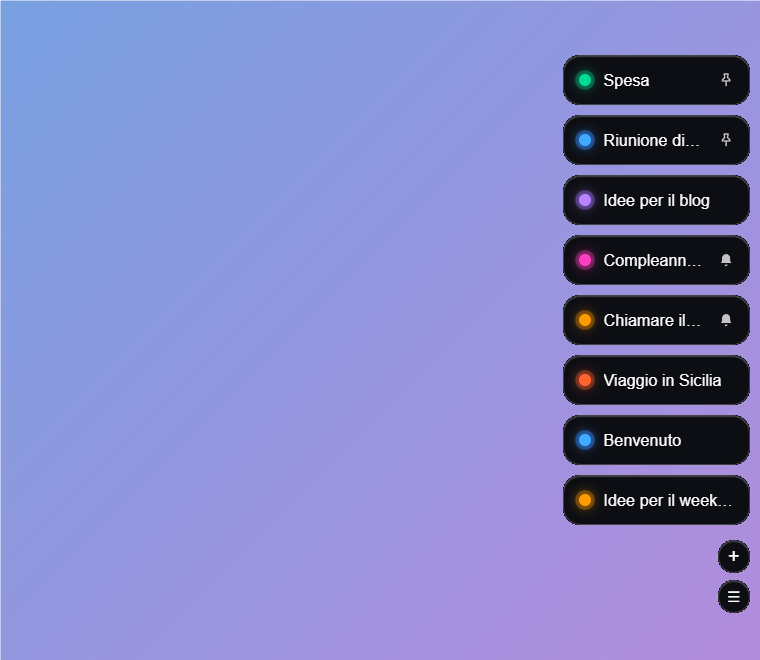
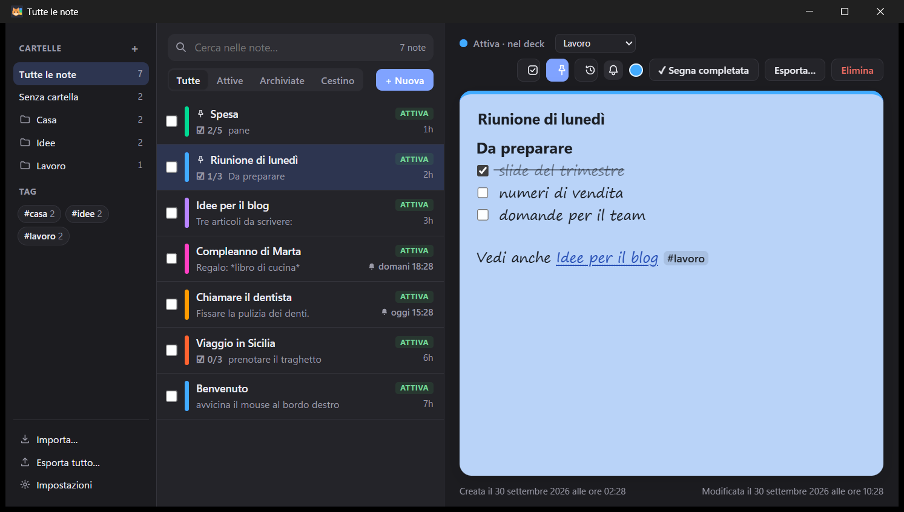

# Tabby

Sticky notes per Windows agganciate al bordo dello schermo. Pillola a riposo, ventaglio di linguette quando il cursore si avvicina, nota a piena dimensione al clic. Il nome viene dalle linguette (*tabs*) del deck… e dal gatto tigrato dell'icona.

Creato da **Roberto Pisco Pisconti**.

Stack: **Tauri 2 (Rust) + SvelteKit (Svelte 5) + SQLite (rusqlite) + CodeMirror 6**.
Il piano è in [`docs/PIANO.md`](docs/PIANO.md); cosa è fatto e cosa resta in [`docs/TODO.md`](docs/TODO.md).





## Scarica

Vai alla pagina delle [**Releases**](https://github.com/RobyPisco/tabby/releases/latest) e scarica `Tabby_*_x64-setup.exe` (oppure l'`.msi`). Serve Windows 10/11, non serve essere amministratori.

L'installer non è ancora firmato: se Windows mostra "App non riconosciuta", scegli *Ulteriori informazioni* → *Esegui comunque*.

## Licenza

[MIT](LICENSE) © 2026 Roberto Pisco Pisconti.

## Cosa fa

- **Deck sul bordo** destro o sinistro, sempre in primo piano e trasparente ai clic a riposo; note fissate in cima; si riposiziona da solo se cambiano monitor, risoluzione o scala.
- **Editor Markdown dal vivo**: caselle da spuntare, titoli, grassetto/corsivo, immagini e allegati incollati o trascinati, link web, link tra note `[[titolo]]` e tag `#parola`; modelli rapidi.
- **Tutte le note**: ricerca full-text (anche senza accenti), filtri, cartelle, tag, selezione multipla, cestino, cronologia delle versioni, "Citata in".
- **Promemoria** con ricorrenza, notifiche di Windows con *10 min / 1 ora / Domani / Fatto*, date scritte a parole ("domani alle 9").
- **Google Calendar** (facoltativo): gli eventi dei prossimi 7-14 giorni diventano note in sola lettura con promemoria; Tabby chiede solo la lettura del calendario e funziona anche dietro proxy aziendali (PAC, autenticazione di Windows).
- **Cattura rapida** degli appunti, **export** (Markdown/testo, un file per nota o file unico) e **import**.
- **Impostazioni**: bordo, larghezza, schermo, carattere, colore delle note nuove, suono, tema, avvio con Windows.

## Scorciatoie

| Tasti | Azione |
| --- | --- |
| `Ctrl+Alt+L` | Tutte le note |
| `Ctrl+Alt+N` | Nuova nota nel deck |
| `Ctrl+Alt+P` | Nuova nota con promemoria |
| `Ctrl+Alt+V` | Salva gli appunti come nota |
| `Ctrl+Alt+H` | Mostra/nascondi il deck |
| `Ctrl+L` / `Ctrl+Invio` | Casella da spuntare / spunta la riga |
| `Ctrl+B` / `Ctrl+I` / `Ctrl+Shift+X` | Grassetto / corsivo / barrato |
| `Ctrl+F`, `Ctrl+N`, `Esc` | Ricerca, nuova nota, chiudi (in "Tutte le note") |

Se un'altra app occupa già una scorciatoia globale, quella viene saltata senza bloccare l'avvio.

## Google Calendar

In *Impostazioni → Google Calendar* clicca "Collega Google", accedi dal browser e scegli i calendari. Tabby ha il permesso di **sola lettura** (non può modificare né cancellare eventi) e il token resta sul tuo PC, in `%APPDATA%\it.pisco.tabby\gcal_token.json`.

Poiché l'app Google non è stata sottoposta alla verifica, al primo accesso Google mostra "app non verificata": scegli *Avanzate* → *Vai a Tabby (non sicuro)*.

## Dati

Tutto resta sul PC, in `%APPDATA%\it.pisco.tabby\` (o nella cartella indicata da `TABBY_DATA_DIR`, utile per le prove): `notes.db` (SQLite), `media\` (immagini e allegati), `settings.json`. Dalle impostazioni c'è "Apri la cartella".

## Sviluppo (Windows 11)

1. **Node.js** 20+ (sviluppato con 24).
2. **Rust** (`rustup`, toolchain `stable-x86_64-pc-windows-msvc`).
3. **Visual Studio Build Tools** con il workload *Sviluppo di applicazioni desktop con C++*.
4. **WebView2** (già presente su Windows 11).

```powershell
git clone https://github.com/RobyPisco/tabby.git
cd tabby
npm install
npm run tauri dev      # sviluppo (la prima build compila parecchi crate, qualche minuto)
npm run check          # controllo TypeScript/Svelte
npm test               # test del frontend (Vitest)
cd src-tauri; cargo test   # test di Rust
npm run tauri build    # installer in src-tauri\target\release\bundle\ (nsis e msi)
```

Per usare Google Calendar in locale serve il Client Secret del progetto Google Cloud: non sta nel repository ma si legge dalla variabile `TABBY_GOOGLE_CLIENT_SECRET` in compilazione. Crea il file `.cargo/config.toml` (ignorato da git) con:

```toml
[env]
TABBY_GOOGLE_CLIENT_SECRET = "il-tuo-secret"
```

Nelle release di GitHub arriva dal secret del repository `GOOGLE_CLIENT_SECRET`. Senza, la build funziona ma "Collega Google" mostra un messaggio d'errore. Chi vuole usare un proprio progetto Google deve sostituire anche il `CLIENT_ID` in `src-tauri/src/gcal.rs`.

In sviluppo le notifiche appaiono come "Windows PowerShell": l'app non è registrata in Windows finché non è installata. Versione di sviluppo e versione installata condividono dati e "istanza unica": non vanno tenute aperte insieme.

L'icona (il gatto tigrato) sta in `assets/app-icon.png` e si applica con `npx tauri icon assets/app-icon.png` (l'icona piccola per l'area di notifica è `src-tauri/icons/tray.png`); le immagini dell'installer (da `assets/`) si rigenerano con `scripts\genera-immagini-installer.ps1`.

## Struttura

- `src-tauri/src/` — `db.rs` (note, ricerca, promemoria), `organize.rs` (tag, cartelle, link, versioni), `reminders.rs` (scheduler), `toast.rs`, `dock.rs` (finestra del deck), `gcal.rs` e `http.rs` (Google Calendar, client WinHTTP), `capture.rs`, `export.rs`, `media.rs`, `settings.rs`, `tray.rs`, `lib.rs` (comandi e avvio).
- `src/routes/+page.svelte` — il deck; `src/routes/all/+page.svelte` — "Tutte le note".
- `src/lib/` — editor (`NoteEditor.svelte`, `editor/`), componenti condivisi, impostazioni, date a parole.
